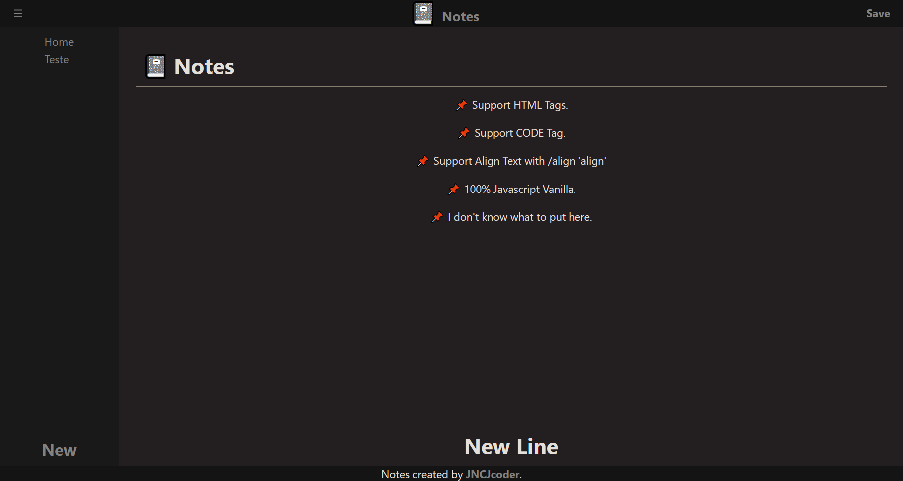

<h1 align="center">
   
  📓 Notes
   
</h1>

<h4 align="center">Notes é uma agenda dinâmica que utiliza tags HTML para a formatação de texto.</h4>
 

## 📝 Sobre

Notes é um projeto muito velho que eu tinha feito para "estudar" HTML/CSS puro e utilizar meu conhecimento de JavaScript no FrontEnd.

 

## 📝 Importante!

> 🚩 As anotações são salvas na localStorage.

> 🚩 Não é um projeto serio, não esta finalizado e não tenho planos para finalizar, porem funciona com algumas tags e possui um comando de alinhamento.

Tags Suportadas: 
- h1 
- h2
- h3
- h4
- h5
- h6
- strong
- em
- p
- small
- a
- label
- code

Comandos: 
- Align

 

## 👨‍🏫 Exemplo de uso

Alinhar no meio:
> /align center

ou

Texto em negrito:
> /strong